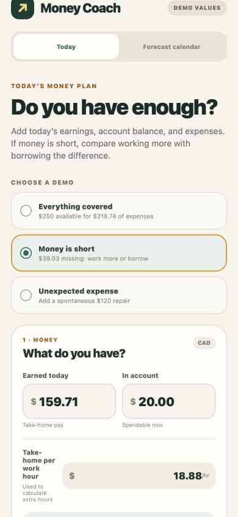
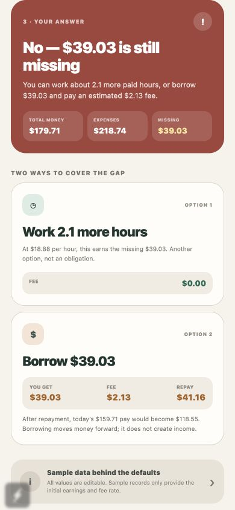
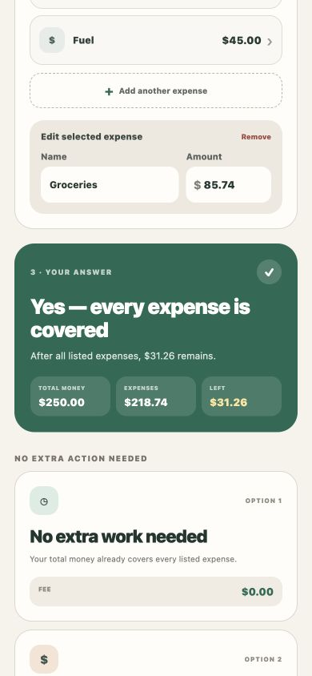
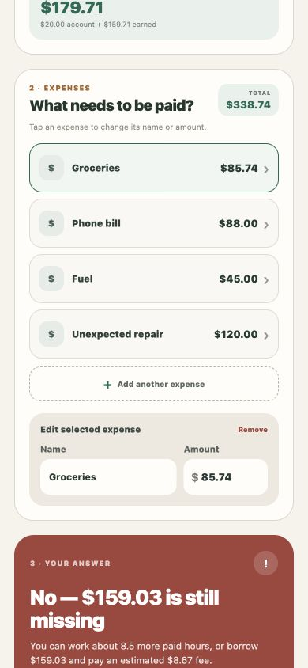
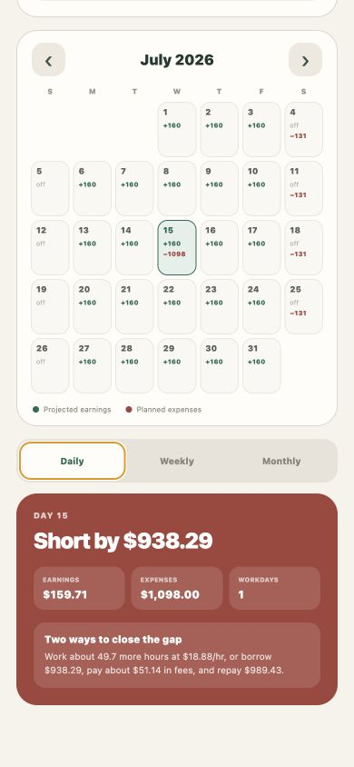
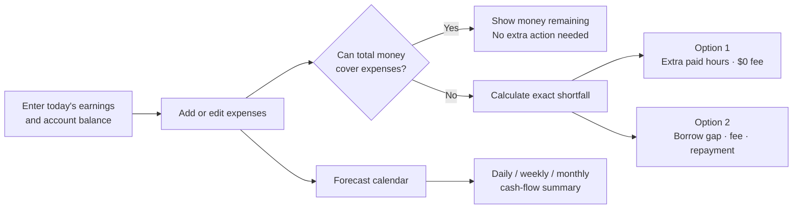

# Money Coach

[](https://github.com/krutarthsathe/money-coach/actions/workflows/verify.yml)


**A mobile decision tool that turns an irregular-income worker's cash shortfall into two understandable choices: the extra paid hours needed, or the exact cost of borrowing.**

Money Coach is designed for gig and daily-wage workers who need an answer now—not another finance dashboard. A worker enters what they earned, what is available in their account, and what must be paid. The app says whether everything is covered and, when it is not, compares the cost of working more with the fee and repayment impact of a cash advance.

Every number is editable for a live demo. The included data is evidence for realistic defaults, never a restriction on the worker's scenario.

## Product screenshots

These are real 390 × 844 captures from the running Expo web build, not design mockups.

<p align="center">
  
  
  
</p>

<p align="center">
  
  
</p>

## The real pain point

Traditional budgeting assumes predictable pay cycles and asks users to categorize the past. A gig worker's immediate question is different:

> “I made this much, I have these expenses, and I am short. What can I actually do?”

Money Coach answers that question in plain language:

- How much did I earn today?
- How much money is available?
- What expenses need to be covered?
- Will my available money cover them?
- If not, how many additional paid hours close the gap?
- If I borrow only the gap, what fee will I pay and what must I repay?
- How does the same situation look for a day, week, or month?

The app deliberately does **not** ask the worker to predict when pay will arrive or when a spontaneous expense will happen. Expenses can be added at any time.

## What is genuinely different

Money Coach is not a generic budget tracker, CRUD expense list, or chatbot wrapper.

1. **Action-equivalent decisions.** One shortfall is translated into comparable units: hours of work, dollars borrowed, fee paid, total repayment, and the effect on the worker's next pay.
2. **Borrowing is never disguised as income.** The UI keeps “you get,” “fee,” and “repay” separate and explains that an advance moves money forward rather than creating income.
3. **The minimum-gap principle.** The engine only models borrowing the uncovered amount instead of suggesting a larger arbitrary loan.
4. **Spontaneous-expense resilience.** Workers can add, remove, rename, or re-price expenses and see every recommendation recalculate immediately.
5. **Calendar pressure, not false certainty.** The forecast exposes editable assumptions and shows daily, weekly, and monthly cash pressure without pretending to know a future deposit time.
6. **Evidence-backed defaults.** Six related CSV datasets are joined into a compact replay payload; the UI remains completely customizable.

## Evidence against the judging criteria

| Criterion | Weight | Evidence in this repository |
| --- | ---: | --- |
| Innovation | 25% | Side-by-side work-hour and borrowing equivalence; minimum-gap advance logic; calendar cash-pressure model; no generic chat or budget-dashboard pattern |
| Technical execution | 25% | React Native + Expo + TypeScript; pure deterministic domain engines; a six-file data preparation pipeline; reusable components; automated CI |
| Functional completeness | 20% | Editable money inputs and expense list, three demo states, covered/shortfall outcomes, advance fee and repayment math, daily/weekly/monthly forecasts |
| Problem-solution fit | 20% | Focused on the immediate decision a worker makes when variable earnings meet essential or spontaneous expenses |
| UX | 5% | Plain-language hierarchy, high-contrast outcome states, progressive three-step flow, mobile-first controls, five authentic screenshots |
| Ambition | 5% | Connects present-day decisions, historical evidence, and forward cash-flow planning in one cross-platform prototype |

## Functional product flow



### Implemented capabilities

| Capability | Status | Where to inspect |
| --- | :---: | --- |
| Editable earnings, account balance, and hourly take-home rate | ✅ | [`App.tsx`](./App.tsx) |
| Add, remove, rename, and re-price expenses | ✅ | [`App.tsx`](./App.tsx) |
| Covered, shortfall, and unexpected-expense demos | ✅ | [`App.tsx`](./App.tsx) |
| Extra work-hours calculation | ✅ | [`decisionEngine.ts`](./src/domain/decisionEngine.ts) |
| Advance amount, fee, repayment, and next-pay impact | ✅ | [`decisionEngine.ts`](./src/domain/decisionEngine.ts) |
| Separate monthly calendar view | ✅ | [`ForecastCalendar.tsx`](./src/components/ForecastCalendar.tsx) |
| Daily, weekly, and monthly forecast summaries | ✅ | [`forecastEngine.ts`](./src/domain/forecastEngine.ts) |
| CSV-to-app data preparation | ✅ | [`buildDemoData.mjs`](./scripts/buildDemoData.mjs) |
| Deterministic scenario verification | ✅ | [`verifyDecision.ts`](./scripts/verifyDecision.ts) |
| GitHub Actions verification | ✅ | [`verify.yml`](./.github/workflows/verify.yml) |

## Demo scenarios

The app opens with three one-tap presets:

1. **Everything covered:** $250.00 is available for $218.74 of expenses, leaving $31.26.
2. **Money is short:** $179.71 is available, leaving a $39.03 gap. At $18.88/hr, 2.1 additional paid hours close it. Borrowing $39.03 costs about $2.13 and requires $41.16 repayment.
3. **Unexpected expense:** a spontaneous $120.00 repair increases the gap to $159.03, the work estimate to 8.5 hours, and the estimated advance fee to $8.67.

After choosing a preset, change any number or expense to demonstrate a custom situation.

## Calculation model

```text
total money = account balance + earned today
shortfall = max(0, total expenses − total money)
extra paid hours = shortfall ÷ take-home hourly pay

advance amount = shortfall
advance fee = shortfall × historical median fee rate
repayment = advance amount + advance fee
next pay after repayment = max(0, earned today − repayment)
```

When all expenses are covered, both extra-work and advance recommendations fall to zero. When money is short, the engine shows two explicit options:

- Work the calculated additional paid hours at a $0 fee.
- Borrow exactly the shortfall and see the fee, repayment, and next-pay impact.

For the exact historical $85.74 advance, the replay uses its observed $4.29 fee. Other amounts use the sample worker's historical median fee rate.

## Forecast model

The separate calendar has four editable assumptions:

- Earnings per workday
- Workdays per week
- Monthly bills
- Weekly essentials

Workday earnings appear on scheduled workdays. Monthly bills are placed on the 15th and weekly essentials on Saturdays so cash-flow pressure is visible. Selecting a date and switching between **Daily**, **Weekly**, and **Monthly** recalculates earnings, expenses, net cash flow, and workdays.

If a selected period is negative, the same decision model explains the additional hours or the borrowing amount, fee, and repayment required to close that projected gap. These are transparent planning assumptions, not promised income or predicted deposit times.

## Technical architecture

```text
Six CSV datasets
      │
      ▼
scripts/buildDemoData.mjs
      │ validates, joins, selects an evidence-backed replay
      ▼
src/data/generatedDemo.json
      │
      ├──► decisionEngine.ts ──► today's covered/shortfall choices
      └──► forecastEngine.ts ──► day/week/month summaries
                                  │
                                  ▼
                      React Native + Expo interface
```

The domain functions are pure and independent from React. That separation makes money math deterministic, testable, and reusable by a future API or native persistence layer.

### Stack

- Expo SDK 57
- React Native 0.86
- React 19
- TypeScript 5.9
- `csv-parse` for data preparation
- Node's strict assertion library for deterministic verification
- GitHub Actions for clean-install validation

### Data lineage

The repository includes 48,612 CSV rows across six related files:

| Dataset | Rows including header | Purpose |
| --- | ---: | --- |
| `daily_earnings.csv` | 12,205 | Daily earnings and hourly take-home evidence |
| `earned_wage_advances.csv` | 536 | Advance amounts, fees, and repayment behavior |
| `recurring_obligations.csv` | 850 | Recurring expense context |
| `transactions.csv` | 31,727 | Deposit and spending records |
| `weekly_cashflow_summary.csv` | 3,073 | Weekly income and outflow summaries |
| `workers.csv` | 221 | Worker-level attributes |

[`buildDemoData.mjs`](./scripts/buildDemoData.mjs) validates required columns, links worker records across files, calculates medians, and writes only the compact payload the app needs. Sample data supplies defaults and traceable evidence; it does not control the editable scenario.

## Run locally

Requires Node.js 22.13 or newer.

```bash
git clone https://github.com/krutarthsathe/money-coach.git
cd money-coach
npm ci
npm run check
```

Run on the web:

```bash
npm run web
```

Run on a phone:

```bash
npm start
```

Install Expo Go and scan the QR code. You can also press `i` for the iOS simulator or `a` for an Android emulator when those tools are installed.

## Verification

```bash
npm run check
```

This regenerates the demo payload, type-checks the project, and runs 16 deterministic scenarios covering:

- Core decisions and historical fee replay
- Covered-now and shortfall worker plans
- Editable expense-list totals
- Unexpected expenses
- Additional work-hour estimates
- Advance amount, fee, repayment, and next-pay impact
- Daily, weekly, and monthly calendar forecasts

CI repeats the same clean-install checks on every push and pull request.

## Repository map

```text
.
├── App.tsx                         # Today screen and editable demo flow
├── data/                           # Six source CSV datasets
├── docs/screenshots/               # Five submission-ready mobile captures
├── scripts/
│   ├── buildDemoData.mjs           # Data validation and replay generation
│   └── verifyDecision.ts           # Deterministic scenario suite
├── src/
│   ├── components/                 # Reusable mobile UI
│   ├── data/generatedDemo.json     # Compact generated payload
│   ├── domain/decisionEngine.ts    # Present-day decision logic
│   └── domain/forecastEngine.ts    # Calendar forecasting logic
└── .github/workflows/verify.yml    # Continuous verification
```

## UX and ethical choices

- Plain language is prioritized over finance terminology.
- Green communicates covered states; red is reserved for a real shortfall.
- The interface shows one decision in progressive order: money → expenses → answer.
- All tap targets have accessibility roles or labels, and core controls have stable test IDs.
- “Work more” is presented as an option, never an obligation.
- A cash advance is never presented as income or as a default recommendation.
- Money Coach is an educational planning demo, not financial advice.

## Scope and ambition

This hackathon build completes the core decision loop without requiring an account, bank connection, or backend. The next product milestones are local scenario persistence, worker-defined recurring schedules, accessibility testing with native screen readers, and opt-in connections to real earnings and obligation data. The current pure-engine architecture is designed so those additions do not require rewriting the financial logic.

## 60-second judging demo

1. Show the **Money is short** preset: $39.03 is missing.
2. Compare **2.1 more paid hours at $0 fee** with **borrow $39.03, pay $2.13, repay $41.16**.
3. Change groceries from $85.74 to $100.00 and show every result update instantly.
4. Switch to **Everything covered** and show that no loan or extra work is suggested.
5. Select **Unexpected expense** to add a spontaneous $120.00 repair.
6. Open **Forecast calendar**, select the 15th, and compare Daily, Weekly, and Monthly results.

For ready-to-paste submission copy and screenshot ordering, see [`SUBMISSION.md`](./SUBMISSION.md).
